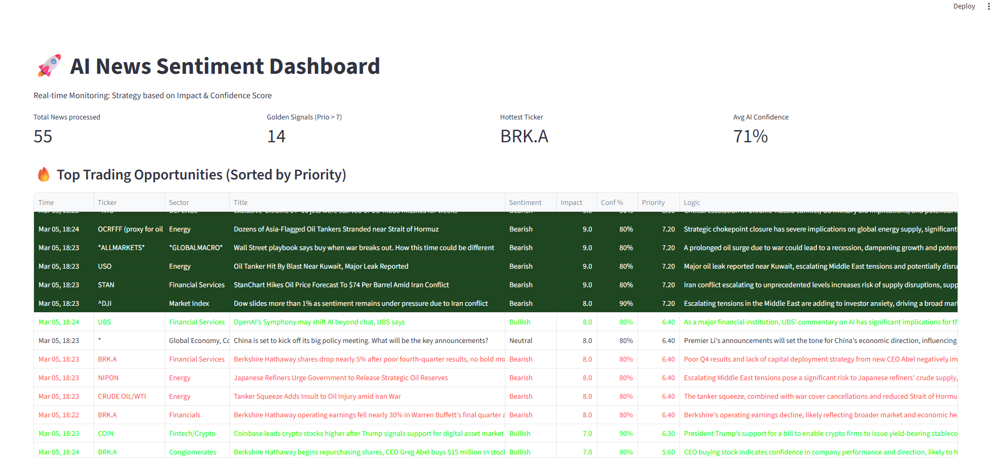

# 🚀 Local-AI News Intelligence Engine (V1)

A high-performance asynchronous pipeline designed to scrape, analyze, and quantify global financial news using local Large Language Models (LLMs). Developed and tested on **NVIDIA RTX 4070 Super** hardware using a **PyTorch 2.7** backend for low-latency inference.

<p align="center">
  
</p>

## 🧠 The Problem
In 2026, financial markets are flooded with information noise. Most traders rely on expensive terminal subscriptions or delayed aggregators. This project provides a **zero-latency, private, and cost-effective** alternative by running state-of-the-art models (Llama 3.1) locally, ensuring that sensitive market queries never leave the host machine.

## 🏗️ Architecture & Data Pipeline
The system follows a modular ETL (Extract, Transform, Load) pattern:

1.  **Extraction:** Real-time RSS ingestion from Reuters, CNBC, Investing.com, and OilPrice.
2.  **Inference:** Local **Llama 3.1 (8B/70B)** via the Ollama orchestration engine.
3.  **Quantification:** A custom **Priority Scoring** algorithm to filter "Golden Signals":
    $$Priority = \frac{Impact (1-10) \times Confidence (0-100)}{100}$$
4.  **Visualization:** Interactive Streamlit dashboard with Plotly-powered time-series and sector analytics.

### 🛠️ Tech Stack
- **Language:** Python 3.10.19
- **AI Backend:** PyTorch 2.7.1 + CUDA 11.8
- **LLM Orchestration:** Ollama 0.6.1
- **Data Handling:** Pandas 2.3.3
- **UI/UX:** Streamlit 1.54.0 & Plotly 6.5.2

## ⚡ Key Features
- **Local-First Inference:** Data privacy guaranteed. Zero API costs and no external dependency on cloud providers.
- **Structured Intelligence:** Automatically transforms unstructured news prose into strictly validated JSON schemas.
- **Weighted Sentiment:** Uses "Bullish/Bearish/Neutral" classification adapted for high-frequency macro analysis.
- **Hardware Context:** Developed and tested on NVIDIA RTX 4070 Super (12GB VRAM)

## 📂 Project Structure

```text
ai-news-sentiment-analysis/
├── data/
│   ├── fetched_urls.log      # History of ingested URLs (duplicate prevention)
│   ├── raw_news.json         # Transient storage for the latest news batch
│   └── processed_news.json   # The "Gold" database with AI scores & logic
├── scripts/
│   ├── get_news_bot.py       # Async RSS ingestion & pre-filtering
│   ├── analyze_news.py       # Async AI inference engine (Ollama + Llama 3.1)
│   ├── run_pipeline.py       # Sequential orchestrator for Crontab
│   └── app.py                # Streamlit Dashboard (Visualization)
├── .gitignore                # Excludes /data/ and venv
├── requirements.txt          # Project dependencies (4070 Super optimized)
└── README.md                 # Project documentation
```

## ⚙️ System Requirements & Environment
This project is built for high-performance local inference. To replicate the results, ensure your environment matches these specifications:

Architecture: x86_64 with WSL2 (Windows Subsystem for Linux) support.

Software Stack
Host OS: Windows 10/11 (for native GPU driver access).

Guest OS: Ubuntu 22.04 LTS (via WSL2).

Package Manager: Miniconda (Recommended) or Anaconda.

Python Version: 3.10.x

CUDA Toolkit: 12.1 (Compatible with the PyTorch 2.7 build).

### 🛠️ Prerequisites

1. **Conda Environment:** This project requires [Miniconda](https://www.anaconda.com/docs/getting-started/miniconda/install) (recommended) or Anaconda installed on your WSL2/Linux instance.
2. **GPU Drivers:** Ensure you have the latest NVIDIA drivers installed on your Windows host.

## 🚀 Getting Started

1. **Clone and Install Dependencies:**

   ```bash
   conda create --name news_ai python=3.10
   conda activate news_ai

   git clone https://github.com/ioan-mares/ai-news-sentiment-analysis.git
   cd ai-news-sentiment-analysis
   pip install -r requirements.txt
   ```

2. **Download the AI Model:**
   Depending on your VRAM (GPU memory), choose one:
   ```bash
    # Balanced (Recommended for 8GB+ VRAM)
    ollama pull llama3.1:8b

    # High Intelligence (Recommended for RTX 3090/4090/5090)
    ollama pull llama3.1:70b
    ```

3. **Ensure Ollama is running Llama 3.1:**
   ```bash
   ollama run llama3.1:latest
   ```

4. **Start the Intelligence Engine:**
   ```bash
   python scripts/run_pipeline.py
   ```

5. **Launch the Visual Dashboard:**
   ```bash
   streamlit run scripts/app.py
   ```

## 📊 Logic & Scoring System
The engine is instructed via a sophisticated System Prompt to avoid "neutrality bias". It forces the LLM to take decisive stances on market impact, using the full 1-10 scale. This ensures that the dashboard highlights genuine "Black Swan" events (Score > 7.0) versus routine market noise.

## 📓 Troubleshooting: Network & SSL Issues (WSL2)
If you encounter SSL: DECRYPTION_FAILED or record layer failure while downloading heavy packages (like PyTorch) over Wi-Fi in WSL2, it is likely due to MTU fragmentation.

Solution:
Manually set the MTU (Maximum Transmission Unit) of the WSL2 network interface to a lower value (e.g., 1000) to ensure packet integrity through the host's network stack:

   ```bash
   # Set MTU to 1000 for high-stability during large downloads
   sudo ip link set dev eth0 mtu 1000
   ```

Then retry ```bash pip install -r requirements.txt ``` a couple times until all deps are installed.

> **Disclaimer:** This project is for research and educational purposes only. It does not constitute financial advice. The author is not responsible for any financial losses incurred from the use of this software.